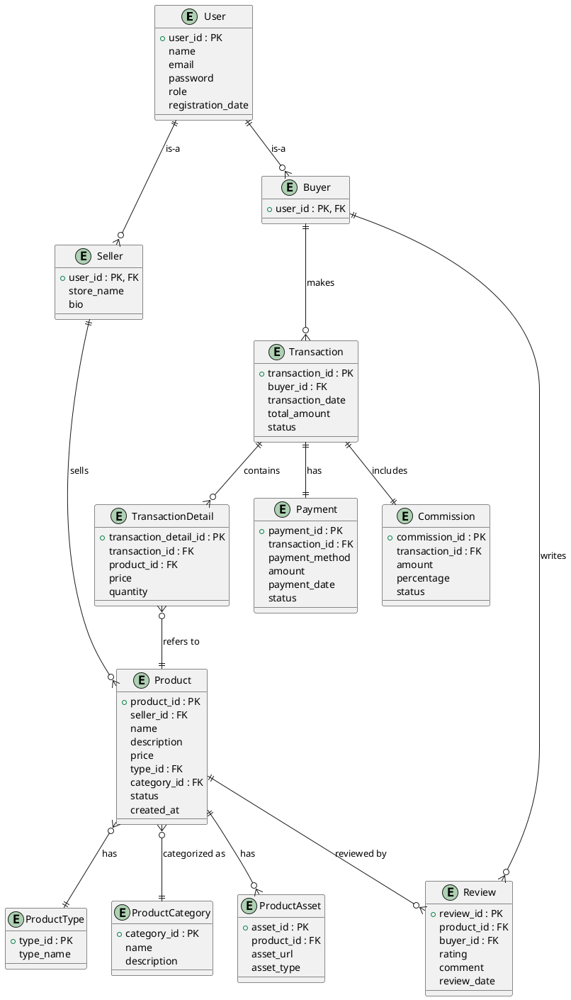

# FASE 1: ANALISIS DAN PERANCANGAN KONSEPTUAL

---

## 1.1 ANALISIS SISTEM

### 1.1.a. Domain Bisnis dan Latar Belakang

Marketplace produk digital adalah sebuah platform daring yang mempertemukan penjual dan pembeli untuk melakukan transaksi produk non-fisik seperti jasa, akun premium, top-up voucher, file digital (e-book, gambar, software), dan lain sebagainya. Platform ini mengotomatisasi proses penjualan, pembayaran, distribusi produk, serta pengelolaan komisi marketplace.

#### Latar Belakang:

- Kebutuhan masyarakat akan transaksi produk digital meningkat pesat (misal: voucher game, jasa desain, langganan streaming).
- Penjual/pemilik produk digital memerlukan wadah yang aman, terstruktur, dan mudah digunakan untuk memasarkan produknya.
- Pembeli membutuhkan proses pencarian, pembayaran, dan penerimaan produk yang cepat & aman.
- Marketplace digital bisa mengambil komisi dari tiap transaksi secara otomatis.

---

### 1.1.b. Identifikasi Stakeholder & Kebutuhan Sistem

| Stakeholder | Peran & Kebutuhan Utama                                                                                                                                          |
| ----------- | ---------------------------------------------------------------------------------------------------------------------------------------------------------------- |
| **Admin**   | - Mengelola data user - Validasi seller - Melihat laporan penjualan dan komisi - Monitoring transaksi                                                   |
| **Seller**  | - Registrasi akun seller - Kelola produk digital (tambah/edit/hapus) - Melihat status pesanan - Menerima notifikasi pembayaran - Lihat review produk |
| **Buyer**   | - Registrasi akun buyer - Mencari & membeli produk digital - Melakukan pembayaran - Menerima produk digital - Memberi review produk                  |

#### Kebutuhan Fungsional Utama:

- Registrasi dan login user (admin, seller, buyer)
- Seller dapat mengelola produk digital
- Buyer dapat mencari, memilih, membeli produk digital
- Sistem pembayaran (virtual account, e-wallet, dsb)
- Pengiriman produk digital otomatis (file/link/kode/jasa) setelah pembayaran
- Review produk oleh buyer
- Komisi otomatis untuk marketplace
- Notifikasi status transaksi
- Riwayat transaksi untuk semua user

#### Kebutuhan Non-Fungsional:

- Sistem basis data konsisten, handal, multi-user, dan scalable
- Integritas data terjaga (constraint, PK/FK)
- Keamanan data (password terenkripsi, data transaksi aman)
- Mudah dikembangkan jika ada penambahan fitur

---

### 1.1.c. Analisis Proses Bisnis yang Diotomatisasi

#### Proses Utama Marketplace Produk Digital:

1. **Registrasi dan Login**

   - Calon user melakukan registrasi dengan memilih peran (buyer, seller, admin)
   - Sistem melakukan validasi email dan menyimpan data user

2. **Manajemen Produk oleh Seller**

   - Seller menambah/edit/hapus produk digital
   - Seller memasukkan detail produk, tipe, kategori, harga, dan mengunggah aset digital (file/link/kode)

3. **Pencarian dan Pemesanan oleh Buyer**

   - Buyer mencari produk berdasarkan nama, kategori, tipe, atau harga
   - Buyer memilih produk dan menambah ke keranjang (opsional)
   - Buyer melakukan checkout

4. **Pembayaran**

   - Buyer memilih metode pembayaran (e-wallet, transfer bank, dsb)
   - Sistem memverifikasi pembayaran

5. **Pengiriman Produk Digital**

   - Setelah pembayaran valid, sistem otomatis mengirimkan aset digital ke buyer
   - Status transaksi diperbarui

6. **Review oleh Buyer**

   - Buyer dapat memberikan review/rating untuk produk yang dibeli

7. **Komisi Marketplace**
   - Sistem otomatis mengambil komisi dari tiap transaksi
   - Laporan komisi bisa diakses admin

---

### 1.1 DELIVERABLE: Dokumen Analisis Kebutuhan Sistem

#### 1.1.1. Latar Belakang & Permasalahan

- Banyak transaksi produk digital dilakukan secara tidak terstruktur, berisiko fraud, dan tidak terdokumentasi dengan baik.
- Marketplace digital hadir sebagai solusi, namun membutuhkan desain basis data yang baik agar proses bisnis berjalan optimal, aman, dan mudah dikelola.

#### 1.1.2. Tujuan Sistem

- Menjadi wadah aman dan efisien untuk transaksi produk digital antara seller dan buyer
- Mengotomatisasi proses penjualan, pembayaran, distribusi, review, dan komisi
- Menyediakan data terstruktur untuk monitoring, audit, dan pengembangan bisnis

#### 1.1.3. Ruang Lingkup

- Hanya mencakup perancangan basis data untuk kebutuhan transaksi produk digital
- Tidak menangani pengiriman produk fisik
- Tidak mengelola refund secara mendalam
- Implementasi pada aplikasi nyata di luar scope (hanya desain database)

#### 1.1.4. Daftar Stakeholder dan Perannya

- **Admin**: Pengelola sistem, validasi, monitoring, laporan
- **Seller**: Menjual produk digital, menerima pesanan, mendapat review
- **Buyer**: Membeli produk digital, melakukan pembayaran, memberi review

#### 1.1.5. Proses Bisnis Utama (Ringkas)

- Registrasi/login user
- Seller menambah/mengelola produk digital
- Buyer mencari/membeli produk digital
- Pembayaran dan verifikasi
- Pengiriman produk digital otomatis
- Review produk oleh buyer
- Pengelolaan komisi marketplace

---

## 1.2 CONCEPTUAL DATA MODELING (ERD Chen Notation)

### 1.2.a. Identifikasi Entitas Utama

| Entitas           | Deskripsi                                             |
| ----------------- | ----------------------------------------------------- |
| User              | Semua user sistem (admin, seller, buyer)              |
| Seller            | User yang berperan sebagai penjual                    |
| Buyer             | User yang berperan sebagai pembeli                    |
| Product           | Produk digital yang dijual                            |
| ProductType       | Jenis produk digital (jasa, akun, top-up, file, dst)  |
| ProductCategory   | Kategori produk digital (game, software, desain, dsb) |
| ProductAsset      | File/link/kode digital yang dikirim ke buyer          |
| Transaction       | Transaksi pembelian produk digital                    |
| TransactionDetail | Rincian produk per transaksi                          |
| Payment           | Pembayaran untuk transaksi                            |
| Review            | Ulasan produk oleh buyer                              |
| Commission        | Komisi marketplace dari setiap transaksi              |

---

### 1.2.b. Atribut Setiap Entitas

| Entitas           | Atribut Utama                                                                                                 |
| ----------------- | ------------------------------------------------------------------------------------------------------------- |
| User              | user_id (PK), name, email, password, role, registration_date                                                  |
| Seller            | user_id (PK, FK ke User), store_name, bio                                                                     |
| Buyer             | user_id (PK, FK ke User)                                                                                      |
| Product           | product_id (PK), seller_id (FK), name, description, price, type_id (FK), category_id (FK), status, created_at |
| ProductType       | type_id (PK), type_name                                                                                       |
| ProductCategory   | category_id (PK), name, description                                                                           |
| ProductAsset      | asset_id (PK), product_id (FK), asset_url, asset_type                                                         |
| Transaction       | transaction_id (PK), buyer_id (FK), transaction_date, total_amount, status                                    |
| TransactionDetail | transaction_detail_id (PK), transaction_id (FK), product_id (FK), price, quantity                             |
| Payment           | payment_id (PK), transaction_id (FK), payment_method, amount, payment_date, status                            |
| Review            | review_id (PK), product_id (FK), buyer_id (FK), rating, comment, review_date                                  |
| Commission        | commission_id (PK), transaction_id (FK), amount, percentage, status                                           |

---

### 1.2.c. Identifikasi Relationship Antar Entitas

| Relasi         | Entitas 1         | Entitas 2         | Kardinalitas | Keterangan                                |
| -------------- | ----------------- | ----------------- | ------------ | ----------------------------------------- |
| is-a           | User              | Seller            | 1 : 0..1     | User bisa menjadi seller                  |
| is-a           | User              | Buyer             | 1 : 0..1     | User bisa menjadi buyer                   |
| sells          | Seller            | Product           | 1 : N        | Seller bisa punya banyak produk           |
| has            | Product           | ProductType       | N : 1        | Produk punya satu tipe                    |
| categorized as | Product           | ProductCategory   | N : 1        | Produk punya satu kategori                |
| has            | Product           | ProductAsset      | 1 : N        | Produk punya banyak asset                 |
| makes          | Buyer             | Transaction       | 1 : N        | Buyer bisa melakukan banyak transaksi     |
| contains       | Transaction       | TransactionDetail | 1 : N        | Transaksi terdiri dari banyak produk      |
| refers to      | TransactionDetail | Product           | N : 1        | Setiap detail transaksi mengacu ke produk |
| has            | Transaction       | Payment           | 1 : 1        | Setiap transaksi ada satu pembayaran      |
| reviewed by    | Product           | Review            | 1 : N        | Produk bisa punya banyak review           |
| writes         | Buyer             | Review            | 1 : N        | Buyer bisa review banyak produk           |
| includes       | Transaction       | Commission        | 1 : 1        | Satu transaksi punya satu komisi          |

---

### 1.2.d. ERD (Entity Relationship Diagram) Chen Notation

---

### 1.2.e. Penjelasan Kardinalitas Rules

- **1 User** bisa menjadi **seller** dan/atau **buyer** (supertype-subtype, 1:0..1)
- **1 Seller** bisa punya **banyak produk** (1:N)
- **1 Produk** hanya punya **1 jenis** dan **1 kategori** (N:1)
- **1 Produk** bisa punya **banyak asset digital** (1:N)
- **1 Buyer** bisa melakukan **banyak transaksi** (1:N)
- **1 Transaksi** bisa terdiri dari **banyak detail produk** (1:N)
- **1 TransactionDetail** hanya mengacu ke **1 produk** (N:1)
- **1 Transaksi** punya **1 pembayaran** dan **1 komisi** (1:1)
- **1 Produk** bisa direview oleh **banyak review** (1:N)
- **1 Buyer** bisa menulis **banyak review** (1:N)

---

### 1.3 Pengelompokan Entitas & Hierarki (Supertype/Subtype)

- **Supertype:** User
- **Subtype:** Seller, Buyer
- Setiap user bisa jadi seller, buyer, atau keduanya (relasi supertype-subtype pada ERD)

---

### 1.3 DELIVERABLE

- **a. ERD dengan supertype/subtype** (sudah tercermin pada diagram dan dokumentasi di atas)
