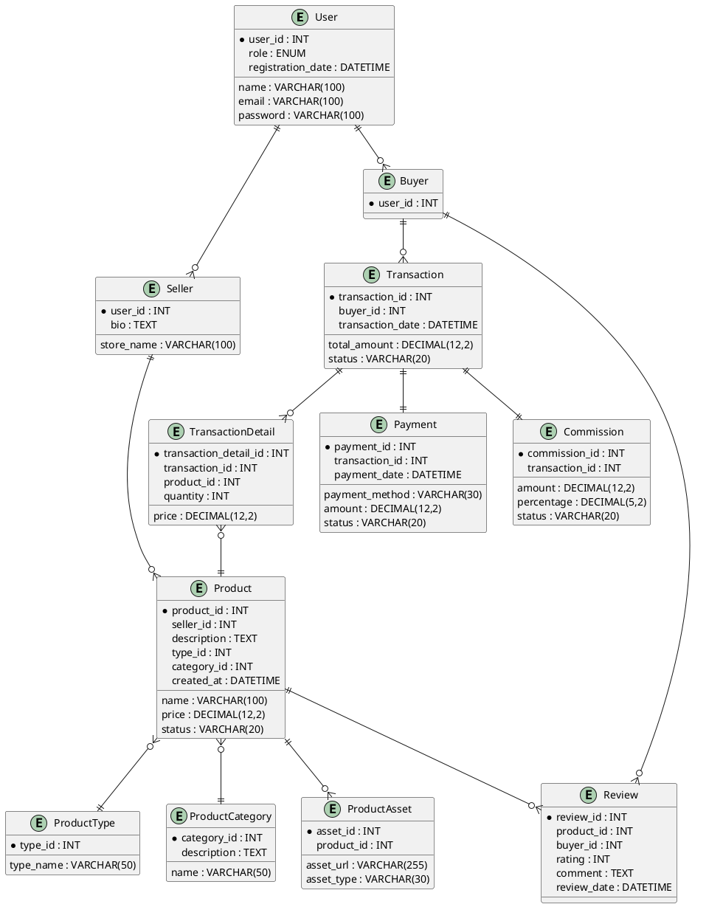

# FASE 2: LOGICAL DESIGN DAN NORMALISASI

---

## 2.1 Normalisasi Database

### 2.1.a. Transformasi ERD ke Tabel-Tabel (Logical Model)

| Tabel             | Deskripsi                                                       |
| ----------------- | --------------------------------------------------------------- |
| User              | Menyimpan data semua user (admin, buyer, seller)                |
| Seller            | Data khusus seller, 1 user hanya bisa jadi 1 seller             |
| Buyer             | Data khusus buyer, 1 user hanya bisa jadi 1 buyer               |
| Product           | Produk digital yang dijual seller                               |
| ProductType       | Jenis produk digital (jasa, akun, topup, file, dll)             |
| ProductCategory   | Kategori produk (game, software, desain, dsb)                   |
| ProductAsset      | File/link/kode digital yang diberikan ke buyer                  |
| Transaction       | Transaksi pembelian produk digital                              |
| TransactionDetail | Detil produk dalam satu transaksi (bisa multi-produk/transaksi) |
| Payment           | Pembayaran oleh buyer                                           |
| Review            | Review/ulasan produk digital oleh buyer                         |
| Commission        | Komisi yang diambil marketplace (per transaksi)                 |

---

### 2.1.b. PROSES NORMALISASI

#### Contoh Normalisasi Rinci: Tabel Product

##### **Data Mentah (Belum Normalisasi)**

| product_id | seller_id | seller_name | product_name | type_id | type_name | category_id | category_name | price | status | created_at |
| ---------- | --------- | ----------- | ------------ | ------- | --------- | ----------- | ------------- | ----- | ------ | ---------- |
| 1          | 20        | Andi Store  | Akun Netflix | 1       | Akun      | 2           | Streaming     | 50000 | aktif  | 2025-07-01 |
| 2          | 20        | Andi Store  | Topup ML     | 3       | Topup     | 1           | Game          | 10000 | aktif  | 2025-07-01 |

---

##### **1NF (First Normal Form)**

- Setiap atribut atomic (tidak ada multi-valued).
- Sudah TERCAPAI.

---

##### **2NF (Second Normal Form)**

- Sudah 1NF.
- Semua atribut non-primary key sepenuhnya bergantung pada PK.
- **Permasalahan:** seller_name, type_name, category_name tidak perlu di tabel Product.
- **Solusi:** Pindahkan seller_name ke tabel Seller, type_name ke ProductType, category_name ke ProductCategory.

| product_id | seller_id | product_name | type_id | category_id | price | status | created_at |
| ---------- | --------- | ------------ | ------- | ----------- | ----- | ------ | ---------- |

**Tabel Referensi:**

- Seller(user_id, store_name)
- ProductType(type_id, type_name)
- ProductCategory(category_id, category_name)

---

##### **3NF (Third Normal Form)**

- Sudah 2NF.
- Tidak ada ketergantungan transitif antar non-prime attribute.
- **Semua non-key attribute hanya bergantung pada PK product_id**.

---

#### Ringkasan Normalisasi Tabel Lain

| Tabel             | 1NF          | 2NF (Referensi)                      | 3NF (Final)                                                              |
| ----------------- | ------------ | ------------------------------------ | ------------------------------------------------------------------------ |
| TransactionDetail | Sudah atomic | product_name dikeluarkan             | transaction_detail_id, transaction_id, product_id, price, quantity       |
| Payment           | Sudah atomic | buyer_name dikeluarkan               | payment_id, transaction_id, payment_method, amount, payment_date, status |
| Review            | Sudah atomic | product_name, buyer_name dikeluarkan | review_id, product_id, buyer_id, rating, comment, review_date            |

---

### 2.1.c. Eliminasi Redundansi Data

- Nama-nama yang bersifat lookup (type_name, category_name, seller_name) dikelola pada tabel referensi.
- Tabel relasi menggunakan foreign key, tidak menyimpan data duplikat.
- Hanya menyimpan ID dan data utama, lookup dilakukan via join antar tabel.

---

### 2.1.d. Tabel Hasil Normalisasi (1NF-2NF-3NF)

**Contoh untuk Product:**

| 1NF (Denormalisasi)                                                                                                         |
| --------------------------------------------------------------------------------------------------------------------------- |
| product_id, seller_id, seller_name, product_name, type_id, type_name, category_id, category_name, price, status, created_at |

| 2NF (Sebagian Referensi)                                                             |
| ------------------------------------------------------------------------------------ |
| product_id, seller_id, product_name, type_id, category_id, price, status, created_at |

| 3NF (Sudah Final)                                                            |
| ---------------------------------------------------------------------------- |
| product_id, seller_id, name, type_id, category_id, price, status, created_at |

---

## 2.2 PHYSICAL DATABASE DESIGN

### 2.2.a. Mapping Logical Model ke Physical Model (MySQL)

| Tabel             | Field                 | Tipe Data (SQL)                | PK/FK/Keterangan                  |
| ----------------- | --------------------- | ------------------------------ | --------------------------------- |
| User              | user_id               | INT AUTO_INCREMENT             | PK                                |
|                   | name                  | VARCHAR(100)                   |                                   |
|                   | email                 | VARCHAR(100), UNIQUE           |                                   |
|                   | password              | VARCHAR(100)                   |                                   |
|                   | role                  | ENUM('buyer','seller','admin') |                                   |
|                   | registration_date     | DATETIME                       |                                   |
| Seller            | user_id               | INT                            | PK, FK ke User.user_id            |
|                   | store_name            | VARCHAR(100)                   |                                   |
|                   | bio                   | TEXT                           |                                   |
| Buyer             | user_id               | INT                            | PK, FK ke User.user_id            |
| Product           | product_id            | INT AUTO_INCREMENT             | PK                                |
|                   | seller_id             | INT                            | FK ke Seller.user_id              |
|                   | name                  | VARCHAR(100)                   |                                   |
|                   | description           | TEXT                           |                                   |
|                   | price                 | DECIMAL(12,2)                  |                                   |
|                   | type_id               | INT                            | FK ke ProductType.type_id         |
|                   | category_id           | INT                            | FK ke ProductCategory.category_id |
|                   | status                | VARCHAR(20)                    |                                   |
|                   | created_at            | DATETIME                       |                                   |
| ProductType       | type_id               | INT AUTO_INCREMENT             | PK                                |
|                   | type_name             | VARCHAR(50)                    |                                   |
| ProductCategory   | category_id           | INT AUTO_INCREMENT             | PK                                |
|                   | name                  | VARCHAR(50)                    |                                   |
|                   | description           | TEXT                           |                                   |
| ProductAsset      | asset_id              | INT AUTO_INCREMENT             | PK                                |
|                   | product_id            | INT                            | FK ke Product.product_id          |
|                   | asset_url             | VARCHAR(255)                   |                                   |
|                   | asset_type            | VARCHAR(30)                    |                                   |
| Transaction       | transaction_id        | INT AUTO_INCREMENT             | PK                                |
|                   | buyer_id              | INT                            | FK ke Buyer.user_id               |
|                   | transaction_date      | DATETIME                       |                                   |
|                   | total_amount          | DECIMAL(12,2)                  |                                   |
|                   | status                | VARCHAR(20)                    |                                   |
| TransactionDetail | transaction_detail_id | INT AUTO_INCREMENT             | PK                                |
|                   | transaction_id        | INT                            | FK ke Transaction.transaction_id  |
|                   | product_id            | INT                            | FK ke Product.product_id          |
|                   | price                 | DECIMAL(12,2)                  |                                   |
|                   | quantity              | INT                            |                                   |
| Payment           | payment_id            | INT AUTO_INCREMENT             | PK                                |
|                   | transaction_id        | INT                            | FK ke Transaction.transaction_id  |
|                   | payment_method        | VARCHAR(30)                    |                                   |
|                   | amount                | DECIMAL(12,2)                  |                                   |
|                   | payment_date          | DATETIME                       |                                   |
|                   | status                | VARCHAR(20)                    |                                   |
| Review            | review_id             | INT AUTO_INCREMENT             | PK                                |
|                   | product_id            | INT                            | FK ke Product.product_id          |
|                   | buyer_id              | INT                            | FK ke Buyer.user_id               |
|                   | rating                | INT                            |                                   |
|                   | comment               | TEXT                           |                                   |
|                   | review_date           | DATETIME                       |                                   |
| Commission        | commission_id         | INT AUTO_INCREMENT             | PK                                |
|                   | transaction_id        | INT                            | FK ke Transaction.transaction_id  |
|                   | amount                | DECIMAL(12,2)                  |                                   |
|                   | percentage            | DECIMAL(5,2)                   |                                   |
|                   | status                | VARCHAR(20)                    |                                   |

---

### 2.2.b. Implementasi PRIMARY KEY, FOREIGN KEY dan Constraint

- Setiap tabel memiliki PRIMARY KEY (lihat kolom bertanda PK).
- FOREIGN KEY menghubungkan entitas sesuai relasi pada logical model.
- Constraint:
  - Email pada User bersifat UNIQUE.
  - ENUM pada role User (buyer, seller, admin).
  - Tipe data disesuaikan dengan kebutuhan data riil.

---

### 2.2.c. Database Schema Diagram

**(Bisa digambar di dbdiagram.io, MySQL Workbench, atau dengan PlantUML seperti berikut)**

---

### 2.2.d. Dokumentasi Mapping Process

- Logical model (ERD) dipetakan ke tabel-tabel dengan tipe data yang efisien.
- Setiap relasi pada ERD diimplementasikan dengan foreign key di tabel fisik.
- Setiap entitas pada ERD menjadi satu tabel pada physical model.
- Atribut multi-value dan lookup (nama, tipe, kategori) dipisah ke tabel referensi.
- Setiap constraint (PK, FK, UNIQUE, ENUM) diimplementasikan untuk menjaga integritas data.

---

## Lampiran: Rangkuman Entitas, Atribut, dan Relasi

### Tabel Entitas & Atribut

| Entitas           | Atribut Utama                                                                             |
| ----------------- | ----------------------------------------------------------------------------------------- |
| User              | user_id, name, email, password, role, registration_date                                   |
| Seller            | user_id, store_name, bio                                                                  |
| Buyer             | user_id                                                                                   |
| Product           | product_id, seller_id, name, description, price, type_id, category_id, status, created_at |
| ProductType       | type_id, type_name                                                                        |
| ProductCategory   | category_id, name, description                                                            |
| ProductAsset      | asset_id, product_id, asset_url, asset_type                                               |
| Transaction       | transaction_id, buyer_id, transaction_date, total_amount, status                          |
| TransactionDetail | transaction_detail_id, transaction_id, product_id, price, quantity                        |
| Payment           | payment_id, transaction_id, payment_method, amount, payment_date, status                  |
| Review            | review_id, product_id, buyer_id, rating, comment, review_date                             |
| Commission        | commission_id, transaction_id, amount, percentage, status                                 |

### Tabel Relasi dan Kardinalitas

| Relasi         | Entitas 1         | Entitas 2         | Kardinalitas | Keterangan                                     |
| -------------- | ----------------- | ----------------- | ------------ | ---------------------------------------------- |
| is-a           | User              | Seller            | 1 : 0..1     | User bisa jadi seller                          |
| is-a           | User              | Buyer             | 1 : 0..1     | User bisa jadi buyer                           |
| sells          | Seller            | Product           | 1 : N        | Seller bisa punya banyak produk                |
| has            | Product           | ProductType       | N : 1        | Produk punya satu tipe                         |
| categorized as | Product           | ProductCategory   | N : 1        | Produk punya satu kategori                     |
| has            | Product           | ProductAsset      | 1 : N        | Produk punya banyak asset                      |
| makes          | Buyer             | Transaction       | 1 : N        | Buyer bisa melakukan banyak transaksi          |
| contains       | Transaction       | TransactionDetail | 1 : N        | Transaksi terdiri dari banyak detail           |
| refers to      | TransactionDetail | Product           | N : 1        | Setiap detail transaksi mengacu ke satu produk |
| has            | Transaction       | Payment           | 1 : 1        | Setiap transaksi ada satu pembayaran           |
| reviewed by    | Product           | Review            | 1 : N        | Produk bisa punya banyak review                |
| writes         | Buyer             | Review            | 1 : N        | Buyer bisa review banyak produk                |
| includes       | Transaction       | Commission        | 1 : 1        | Satu transaksi punya satu komisi               |
